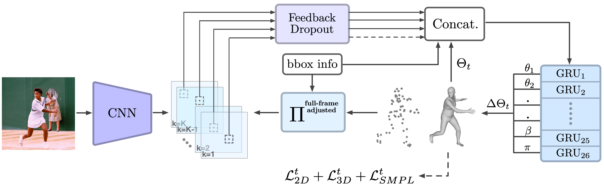

## ReFit
Code repository for the paper: \
**ReFit: Recurrent Fitting Network for 3D Human Recovery**  
[Yufu Wang](https://yufu-wang.github.io), [Kostas Daniilidis](https://www.cis.upenn.edu/~kostas/)\
ICCV 2023 \
[[Project Page](https://yufu-wang.github.io/refit_humans/)]




## Installation instructions
```
python3 -m venv refit
source refit/bin/activate
pip install -U pip
pip install -r requirements.txt
```

## Prepare data
There are some few key data you need for the demo, training and evaluation.
1. [SMPL](https://smpl.is.tue.mpg.de): Please donwload <strong>SMPL_NEUTRAL/FEMALE/MALE.pkl</strong> and put them under `data/smpl`
2. [ReFit weights](https://drive.google.com/drive/folders/1B5V_CiCxwmsnJBGJJjJiLqcRHA6glWxx?usp=share_link): download each checkpoint folders and put them under `data/pretrain`
3. [Yolov7](https://github.com/WongKinYiu/yolov7/releases/download/v0.1/yolov7-e6e.pt): for detection, download this Yolov7 checkpoint and put it under `data/pretrain`. Be sure to also clone the yolov7 submodule with `git clone --recurse-submodules this-repo`.

Additionally for training and evaluation, please follow the dataset preparation guide [here](data). 


## Demo
We provide a few examples in `data/examples`. Running the following demo will detect each person in each image and then run ReFit for 3D reconstruction. The resulting rendering will be saved.
```
python demo.py
```

## Training and evaluation
Training: <strong>config.yaml</strong>, <strong>config_bedlam.yaml</strong> and <strong>config_all.yaml</strong> control the dataset composition.
```
python train.py --cfg configs/config.yaml 
```

Evaluation:
```
python scripts/eval.py
```

## Acknowledgements
We benefit greatly the following repos, from which we adapted parts of our code.
- [SPIN](https://github.com/nkolot/SPIN)
- [PARE](https://github.com/mkocabas/PARE)
- [PyMAF](https://github.com/HongwenZhang/PyMAF)
- [CLIFF](https://github.com/huawei-noah/noah-research/tree/master/CLIFF)
- [BEDLAM](https://github.com/pixelite1201/BEDLAM)
  

## Citing
If you find the model and code useful, please consider citing the following paper:

	@Inproceedings{wang23refit,
	  Title          = {ReFit: Recurrent Fitting Network for 3D Human Recovery},
	  Author         = {Yufu Wang and Kostas Daniilidis},
	  Booktitle      = {International Conference on Computer Vision},
	  Year           = {2023}
	}
